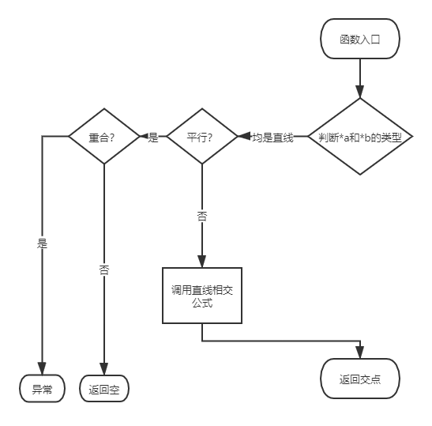

| PSP2.1                                  | Personal Software Process Stages        | 预估耗时（分钟） | 实际耗时（分钟） |
| :-------------------------------------- | :-------------------------------------- | :--------------- | :--------------- |
| Planning                                | 计划                                    | 2                | 5                |
| · Estimate                              | · 估计这个任务需要多少时间              | 2                | 5                |
| Development                             | 开发                                    | 288              |                  |
| · Analysis                              | · 需求分析 (包括学习新技术)             | 180              | 200              |
| · Design Spec                           | · 生成设计文档                          | 20               | 15               |
| · Design Review                         | · 设计复审 (和同事审核设计文档)         | 3                | 1                |
| · Coding Standard                       | · 代码规范 (为目前的开发制定合适的规范) | NaN              | 2                |
| · Design                                | · 具体设计                              | 15               | 10               |
| · Coding                                | · 具体编码                              | 30               | 40               |
| · Code Review                           | · 代码复审                              | 10               | 5                |
| · Test                                  | · 测试（自我测试，修改代码，提交修改）  | 30               |                  |
| Reporting                               | 报告                                    | 20               |                  |
| · Test Report                           | · 测试报告                              | 10               |                  |
| · Size Measurement                      | · 计算工作量                            | 5                |                  |
| · Postmortem & Process Improvement Plan | · 事后总结, 并提出过程改进计划          | 5                |                  |
|                                         | 合计                                    | 310              |                  |

需求分析

本次作业需要做一个计算平面直角坐标系中直线于直线之间交点的程序。

那么就浮现出以下几个问题：

+ 如何表示点：

  封装一个类，包含$x$和$y$两个属性

+ 如何去表示直线：

  $y=kx+b$似乎面对平行于y轴的直线有点无力，采用$ax+by+c=0$的形式

  封装一个类，包含$a$，$b$，$c$三个属性

+ 直线和直线的交点如何求：

  直线联立解方程，给出预先解好的结果，直接代入求解

  $x=\frac {b_1*c_2-b_2*c_1}{a_1*b_2-a_2*b_1}$，$y=\frac {a_2*c_1-a_1*c_2}{a_1*b_2-a_2*b_1}$

+ 特殊情况有哪些

  + 点重合

    根据样例3，这种情况只算一个点

  + 直线平行但不重合

    意识到不可以直接带入上述公式，需要作出判断

  + 直线重合

    有无数解，但是题目规定**题目输入保证答案只有有限个**，故暂不考虑，编码时可以考虑使用`assert`

+ 其他问题

  + 没用过C++

    预计花费一小时学习和摸索语法和特殊用法

  + 没用过Visual Studio，而且linux系统上没有VS

    预计花费两个小时熟悉IDE的编辑、调试和项目管理，以及性能测试等功能


设计

我设计了以下几个类和一个函数：

```c++
//Graph.h
class Dot {};//用于表示一个点

class Graph {};//接口，便于扩展圆

class Line : public Graph {};//用于表示一条线

/*  用于计算图像和图像之间的交点
	params: Graph *a, Graph *b
	return: 图a和图b的交点列表
*/
vector<Dot> solve(Graph *a, Graph *b);
```

```c++
class Container {};//用于存储交点，并除去重合的点
```

其中`solve`函数逻辑如下：

