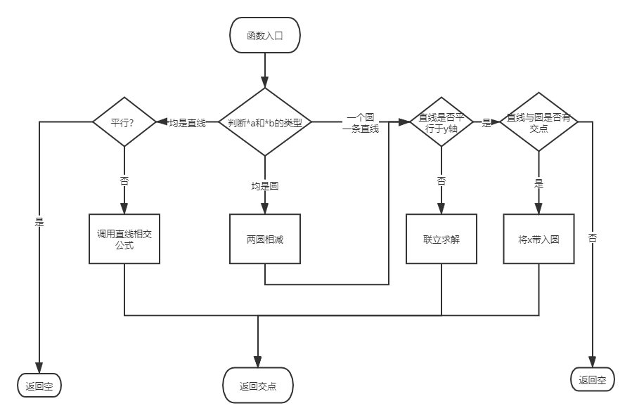

| 项目                                              | 内容                                                         |
| :------------------------------------------------ | :----------------------------------------------------------- |
| 课程：北航2020春软件工程                          | [博客园班级博客](https://edu.cnblogs.com/campus/buaa/BUAA_SE_2020_LJ) |
| 作业：完成一个平面图形求交点的程序，体验PSP的过程 | [个人项目作业](https://edu.cnblogs.com/campus/buaa/BUAA_SE_2020_LJ/homework/10429) |
| 我在这个课程的目标是                              | 体验软件开发的全流程                                         |
| 这个作业在哪个具体方面帮助我实现目标              | 体会PSP的过程                                                |
| 教学班级                                          | 006                                                          |
| 项目地址                                          | https://github.com/lzhmarkk/lineCross                        |


### 时间规划

| PSP2.1                                  | Personal Software Process Stages        | 预估耗时（分钟） | 实际耗时（分钟） |
| :-------------------------------------- | :-------------------------------------- | :--------------- | :--------------- |
| Planning                                | 计划                                    |                  |                  |
| · Estimate                              | · 估计这个任务需要多少时间              | 2                | 5                |
| Development                             | 开发                                    |                  |                  |
| · Analysis                              | · 需求分析 (包括学习新技术)             | 180              | 200              |
| · Design Spec                           | · 生成设计文档                          | 20               | 15               |
| · Design Review                         | · 设计复审 (和同事审核设计文档)         | 3                | 1                |
| · Coding Standard                       | · 代码规范 (为目前的开发制定合适的规范) | NaN              | 2                |
| · Design                                | · 具体设计                              | 15               | 10               |
| · Coding                                | · 具体编码                              | 30               | 80               |
| · Code Review                           | · 代码复审                              | 10               | 5                |
| · Test                                  | · 测试（自我测试，修改代码，提交修改）  | 30               | 120              |
| Reporting                               | 报告                                    |                  |                  |
| · Test Report                           | · 测试报告                              | 10               | 30               |
| · Size Measurement                      | · 计算工作量                            | 5                | 5                |
| · Postmortem & Process Improvement Plan | · 事后总结, 并提出过程改进计划          | 5                | 5                |
|                                         | 合计                                    | 310              | 478              |

### 需求分析

本次作业需要做一个计算平面直角坐标系中直线于直线之间交点的程序。

那么就浮现出以下几个问题：

+ 如何表示点：

  封装一个类，包含$x$和$y$两个属性

+ 如何去表示直线：

  $y=kx+b$似乎面对平行于y轴的直线有点无力，采用$ax+by+c=0$的形式

  封装一个类，包含$a$，$b$，$c$三个属性

+ 如何去表示圆：

  $(x-m)^2+(y-n)^2=r^2$

  封装一个类，包含$m$，$n$，$r$三个属性

+ 直线和直线的交点如何求：

  直线联立解方程，给出预先解好的结果，直接代入求解

  $x=\frac {b_1*c_2-b_2*c_1}{a_1*b_2-a_2*b_1}$，$y=\frac {a_2*c_1-a_1*c_2}{a_1*b_2-a_2*b_1}$

+ 直线与圆的交点如何求：

  + 若直线不平行于y轴：

    联立解方程，可以得到$ix^2+jx+k=0$，其中$i=a^2+b^2$，$j=2ac+2nab-2mb^2$，$k=(m^2+n^2-r^2)b^2+c^2-2nbc$

    再考虑解$ix^2+jx+k=0$这个方程得到交点的x值，回代直线方程得到交点坐标

  + 若直线平行于y轴：

    判断半径与圆心到直线的距离关系，若半径更大，说明有交点，交点纵坐标可通过已知的横坐标代入圆方程解出；若半径更小，说明无交点

+ 圆和圆的交点如何求：

  两圆方程相减，得到公共弦方程或者公共切点的公切线方程或者两圆重心所在直线。再用该直线与其中任一圆相交，可得到交点。

+ 特殊情况有哪些

  + 点重合

    根据样例3，这种情况只算一个点

  + 直线平行但不重合

    意识到不可以直接带入上述公式，需要作出判断

  + 直线重合

    有无数解，但是题目规定**题目输入保证答案只有有限个**，故暂不考虑，编码时可以考虑使用`assert`

  + 圆重合

    有无数解，但是题目规定**题目输入保证答案只有有限个**，故暂不考虑，编码时可以考虑使用`assert`

+ 其他问题

  + 没用过C++

    预计花费一小时学习和摸索语法和特殊用法

  + 没用过Visual Studio，而且linux系统上没有VS

    预计花费两个小时熟悉IDE的编辑、调试和项目管理，以及性能测试等功能


### 设计

我设计了以下几个类和一个函数：

```c++
//Graph.h
class Dot {};//用于表示一个点

class Graph {};//接口，便于扩展圆

class Line : public Graph {};//用于表示一条线

class Circle : public Graph {};//用于表示一个圆

/*  用于计算图像和图像之间的交点
	params: Graph *a, Graph *b
	return: 图a和图b的交点列表
*/
vector<Dot> solve(Graph *a, Graph *b);
```

```c++
class Container {};//用于存储交点，并除去重合的点
```

其中`solve`函数逻辑如下：



### 测试

在测试方面，首先测试Dot类，其中包括了以下几个方面：

+ 构造函数
+ equals()方法测试，尤其是队友double类型的