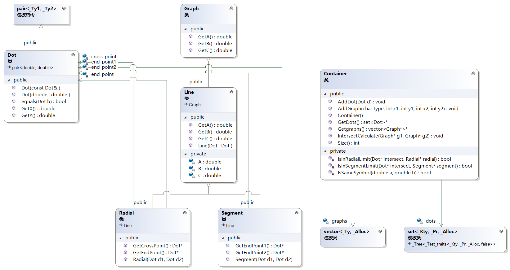
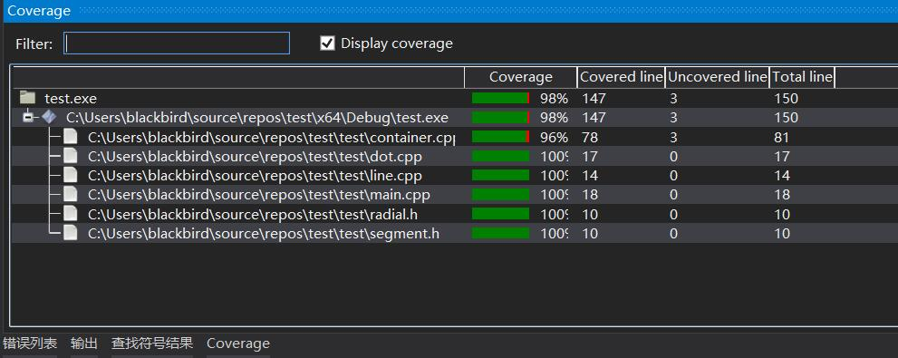

# [2020 BUAA 软件工程]结对项目作业

| 项目                                 | 内容                                                         |
| :----------------------------------- | :----------------------------------------------------------- |
| 这个作业属于哪个课程                 | [2020春北航计算机学院软件工程(罗杰 任健)](https://edu.cnblogs.com/campus/buaa/BUAA_SE_2020_LJ/) |
| 这个作业的要求在哪里                 | [结对项目作业](https://edu.cnblogs.com/campus/buaa/BUAA_SE_2020_LJ/homework/10466) |
| 我在这个课程的目标是                 | 系统学习软件工程相关知识，培养自己的软件开发能力与团队协作能力，接受一定的实战锻炼 |
| 这个作业在哪个具体方面帮助我实现目标 | 练习结对项目开发                                             |


## 1. 教学班级和**可克隆**的 Github 项目地址

- 教学班级：006

- 项目地址：https://github.com/blackbird52/IntersectProject.git

- 目录结构：

  ```
  IntersectProject/
  ├── bin
  │   ├── intersect.exe
  │   └── core.dll
  ├── README.md
  ├── src
  │   ├── main.cpp
  │   └── core
  │   │   ├── container.h
  │   │   ├── dot.h
  │   │   ├── exception.h
  │   │   ├── framework.h
  │   │   ├── graph.h
  │   │   ├── IOHandler.h
  │   │   ├── line.h
  │   │   ├── pch.h
  │   │   ├── radial.h
  │   │   ├── segment.h
  │   │   ├── container.cpp
  │   │   ├── dllmain.cpp
  │   │   ├── dot.cpp
  │   │   ├── IOHandler.cpp
  │   │   ├── line.cpp
  │   │   ├── pch.cpp
  │   │   ├── radial.cpp
  │   │   └── segment.cpp
  └── test
      ├── pch.h
      ├── pch.cpp
      ├── UnitTestIntersect.cpp
      ├── UnitTestInterface.cpp
      └── UnitTestException.cpp
  ```

------


## 2.  在下述 PSP 表格记录下估计将在程序的各个模块的开发上耗费的时间

| PSP2.1                                  | Personal Software Process Stages        | 预估耗时（分钟） | 实际耗时（分钟） |
| :-------------------------------------- | :-------------------------------------- | :--------------- | :--------------- |
| Planning                                | 计划                                    |                  |                  |
| · Estimate                              | · 估计这个任务需要多少时间              |                  |                  |
| Development                             | 开发                                    |                  |                  |
| · Analysis                              | · 需求分析 (包括学习新技术)             |                  |                  |
| · Design Spec                           | · 生成设计文档                          |                  |                  |
| · Design Review                         | · 设计复审 (和同事审核设计文档)         |                  |                  |
| · Coding Standard                       | · 代码规范 (为目前的开发制定合适的规范) |                  |                  |
| · Design                                | · 具体设计                              |                  |                  |
| · Coding                                | · 具体编码                              |                  |                  |
| · Code Review                           | · 代码复审                              |                  |                  |
| · Test                                  | · 测试（自我测试，修改代码，提交修改）  |                  |                  |
| Reporting                               | 报告                                    |                  |                  |
| · Test Report                           | · 测试报告                              |                  |                  |
| · Size Measurement                      | · 计算工作量                            |                  |                  |
| · Postmortem & Process Improvement Plan | · 事后总结, 并提出过程改进计划          |                  |                  |
|                                         | 合计                                    |                  |                  |

------


## 3. 说明在结对编程中是如何利用教科书和其它资料中的方法对接口进行设计的 


------


## 4. 计算模块接口的设计与实现过程。说明你的算法的关键（不必列出源代码），以及独到之处

### 解题思路

#### 几何形状表示方法

根据题目所给定的信息，直线、射线和线段均由线上两点表示。

在求交点时，为方便计算，所有几何形状统一表示成直线，在求出交点后再判断是否满足射线、线段的限定条件。

为方便表示所有类型的直线，同时便于判断平行和求交点，采用直线的一般式方程来描述：

$$ Ax+By+C=0 $$

这里，$A,\ B,\ C$ 三个量的计算方法为：

- $A=y_2-y_1$
- $B=x_1-x_2$
- $C=x_2*y_1-x_1*y_2$

在这种情况下，两直线平行时：

$$A_1B_2=A_2B_1$$

#### 交点计算

在用直线的一般式方程来描述时，两直线交点坐标：

$$(\frac{B_1C_2-B_2C_1}{A_1B_2-A_2B_1},\ \frac{A_2C_1-A_1C_2}{A_1B_2-A_2B_1})$$

如果两形状中存在射线，则判断射线的端点与交点的位置关系，交点是否在端点沿射线方向的一侧。

如果两形状中存在线段，则判断线段的两端点与交点的位置关系，交点是否在两端点之间。

#### 判断方法

目前没有想到好的判断方法，所使用的就是暴力枚举，每加入一个新几何形状，将其与集合中每一个元素求交点。

#### 复杂度

因为是暴力枚举，复杂度仅能达到 $O(n^2)$。

### 设计实现过程

#### 交点类 Dot

交点类通过继承 `pair<double, double> ` 实现，操作比较简单。

为了判断重复交点，需要重写 `equals` 函数。

```c++
class Dot : public pair<double, double>;
```

其中考虑到浮点数的精度问题，定义了一个宏函数 `DoubleEquals`。

```c++
#define DoubleEquals(a, b) (fabs((a) - (b)) < 1e-10)
```

#### 图形类

##### Graph

所有几何形状的共同父类，由于统一用直线的一般式表示，定义获取三个参数的虚函数。

```c++
class Graph {
public:
	virtual double GetA() = 0;
	virtual double GetB() = 0;
	virtual double GetC() = 0;
};
```

##### Line

通过继承 `Graph` 实现。

```c++
class Line : public Graph {
private:
	double A, B, C;
};
```

##### Radial

通过继承 `Line` 实现。

```c++
class Radial : public Line {
private:
	Dot* end_point;
	Dot* cross_point;
};
```

##### Segment

通过继承 `Line` 实现。

```c++
class Segment : public Line {
private:
	Dot* end_point1;
	Dot* end_point2;
};
```

#### 交点容器类 Container

用于存储图形，存储并除去重合的交点。

```c++
class Container {
private:
	vector<Graph*>* graphs;
	set<Dot>* dots;
};
```

#### 计算

两直线平行直接使用公式 $A_1B_2=A_2B_1$ 判断。

```c++
double denominator = A1 * B2 - A2 * B1;

if (!DoubleEquals(denominator, 0)) {
    ……
}
```

交点计算同样套用公式 $(\frac{B_1C_2-B_2C_1}{A_1B_2-A_2B_1},\ \frac{A_2C_1-A_1C_2}{A_1B_2-A_2B_1})$。

```c++
double x = (B1 * C2 - B2 * C1) / denominator;
double y = (A2 * C1 - A1 * C2) / denominator;
Dot* intersect = new Dot(x, y);
```

#### 判断

##### 判断交点是否在射线上

交点是否在射线上，其实就是交点是否在端点沿射线方向的一侧。

通过判断交点与端点组成的向量是否与射线射线上一点与端点组成的向量同向，即可得到答案。

```c++
return IsSameSymbol((cross_point->GetX() - end_point->GetX()), (intersect->GetX() - end_point->GetX()))
		&& IsSameSymbol((cross_point->GetY() - end_point->GetY()), (intersect->GetY() - end_point->GetY()));
```

##### 判断交点是否在线段上

交点是否在线段上就非常简单了，暴力判断交点的横纵坐标是否在线段两端点的横纵坐标范围内。

```c++
return intersect->GetX() >= min(end_point1->GetX(), end_point2->GetX())
		&& intersect->GetX() <= max(end_point1->GetX(), end_point2->GetX())
		&& intersect->GetY() >= min(end_point1->GetY(), end_point2->GetY())
		&& intersect->GetY() <= max(end_point1->GetY(), end_point2->GetY());
```

#### 封装为独立模块

封装后只暴露 $Container$ 类，设计以下接口：

- 项目核心功能交点计算
  - `void AddGraph(char type,int x1, int y1, int x2, int y2);;`
  - `void IntersectCalculate(Graph* g1, Graph* g2)`
- 获取交点个数，完成题目要求
  - `int Size()`
- 获取图形集合和交点集合，为 $UI$ 设计做准备
  - `vector<Graph*>* Getgraphs()`
  - `set<Dot>* GetDots()`

------


## 5. 画出 UML 图显示计算模块部分各个实体之间的关系



- `Dot` 继承了 `pair<double, double>`
- `Line` 继承了 `Graph`
- `Radial` 和 `Segment` 继承了 `Line`
- `Radial` 和 `Segment` 关联了`Dot`
- `Container` 关联了 `Graph` 和 `Dot`

------


## 6.  计算模块接口部分的性能改进


## 7. Design by Contract，Code Contract


## 8. 计算模块部分单元测试展示

## 单元测试

### 消除 Code Quality Analysis 中的所有警告


### 单元测试

#### 覆盖率



#### 扩展计算交点功能

##### TestDot

测试 $Dot$ 类的 5 个函数

- 构造函数 `Dot(double, double)`
- 拷贝构造 `Dot(const Dot&)`
- 获取坐标 `double GetX()`，`double GetY()`
- 相等判断 `bool equals(Dot b)`

其中测试重点在相等判断上，需要修正 $double$ 的精度误差，例如

- $77940 / 11959+1.11111111- 1.11111111$
- $78005 / 11969 +0.33333333- 0.33333333$
- $16451 / 16447 + 0.99999999 - 0.99999999$
- $48119 / 48121 + 0.000000003 - 0.000000003$

##### Test Line, Radial, Segment

测试图形类的函数

- 构造函数
- 获取参数
- 获取端点

这方面比较简单，无需赘述。

##### TestSolve

测试交点的平行、计算与位置关系，包括

- 一般情况
- 平行

```c++
segment = new Segment(Dot(1, 1), Dot(1, -1));
line = new Line(Dot(2, 2), Dot(2, 0));
radial = new Radial(Dot(3, 3), Dot(3, 4));

```

- 交点与交点重合

```c++
segment = new Segment(Dot(-1, 3), Dot(2, -1));
line = new Line(Dot(-2, 2), Dot(3, 0));
radial = new Radial(Dot(-3, 0), Dot(4, 2));

```

- 端点与端点重合

```c++
segment = new Segment(Dot(0, 2), Dot(3, -1));
line = new Line(Dot(4, 2), Dot(5, 0));
radial = new Radial(Dot(0, 2), Dot(3, -1));

```

- 端点与交点重合

```c++
segment = new Segment(Dot(0, 2), Dot(3, -1));
line = new Line(Dot(0, 2), Dot(2, 2));
radial = new Radial(Dot(0, 2), Dot(3, -1));

```

#### 将扩展后的功能封装为独立模块

回归测试，同时测试模块接口

```c++
container->AddGraph('S', -1, 3, 2, -1);
container->AddGraph('L', -2, 2, 3, 0);
container->AddGraph('R', -3, 0, 4, 2);
Assert::AreEqual(container->Size(), 1);

container = new Container();
container->AddGraph('S', 1, 1, 1, -1);
container->AddGraph('L', 2, 2, 2, 0);
container->AddGraph('R', 3, 3, 3, 4);
Assert::AreEqual(container->Size(), 0);

……

```

------


## 9. 计算模块部分异常处理说明


## 10. 界面模块的详细设计过程


## 11. 界面模块与计算模块的对接


## 12. 结对的过程


## 13. 说明结对编程的优点和缺点，同时描述结对的每一个人的优点和缺点在哪里


## 14. 实现完程序之后，在PSP表格记录下你在程序的各个模块上实际花费的时间

| PSP2.1                                  | Personal Software Process Stages        | 预估耗时（分钟） | 实际耗时（分钟） |
| :-------------------------------------- | :-------------------------------------- | :--------------- | :--------------- |
| Planning                                | 计划                                    |                  |                  |
| · Estimate                              | · 估计这个任务需要多少时间              |                  |                  |
| Development                             | 开发                                    |                  |                  |
| · Analysis                              | · 需求分析 (包括学习新技术)             |                  |                  |
| · Design Spec                           | · 生成设计文档                          |                  |                  |
| · Design Review                         | · 设计复审 (和同事审核设计文档)         |                  |                  |
| · Coding Standard                       | · 代码规范 (为目前的开发制定合适的规范) |                  |                  |
| · Design                                | · 具体设计                              |                  |                  |
| · Coding                                | · 具体编码                              |                  |                  |
| · Code Review                           | · 代码复审                              |                  |                  |
| · Test                                  | · 测试（自我测试，修改代码，提交修改）  |                  |                  |
| Reporting                               | 报告                                    |                  |                  |
| · Test Report                           | · 测试报告                              |                  |                  |
| · Size Measurement                      | · 计算工作量                            |                  |                  |
| · Postmortem & Process Improvement Plan | · 事后总结, 并提出过程改进计划          |                  |                  |
|                                         | 合计                                    |                  |                  |

